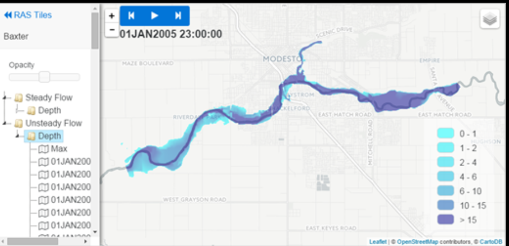

# All original codes are HEC-RAS developed, i just did a few modifications and share it here,it might helps this community.

# Usage documentation reference: https://www.hec.usace.army.mil/confluence/rasdocs/rmum/6.2/tile-map-server

# Initialize server:
### machine: ubuntu2204

suppose you have correctly installed nvm.
```
nvm install 4.2.1 &&  nvm use 4.2.1
node --version
rm -rf node_modules
npm cache clean

npm install
node ./server.js
```

